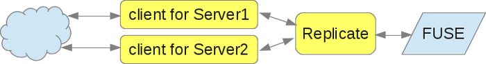

!SLIDE 
# Introduction to GlusterFS #

<!SLIDE bullets>
# What is GlusterFS? #
.notes GlusterFS is a clustered filesystem providing a single filesystem interface to an amalgamation of traditional filesystems across multiple servers.

* Clustered Filesystem
  * All clients connect to all servers
  * Distribution
  * Replication
  * Stripe (rarely)

<!SLIDE bullets>
# What isn't GlusterFS? #
* RAID
  * RAID-0
  * RAID-1
  * RAID-5
  * ...
* DRBD
  * No "master" or "slave"
  * No journal

<!SLIDE bullets incremental transition=fade>
# Why GlusterFS? #
.notes Because GlusterFS is fully posix compliant, you ''can'' run your current applications without any modifications.
.notes By using the replication features and sufficient hardware, GlusterFS can provide a consistent filesystem enterprise-wide with no single points of failure.
.notes By adding more nodes, you can scale GlusterFS for additional performance and/or capacity.
.notes Even with purchasing Red Hat support contracts for Red Hat Storage, a GlusterFS solution still comes in with a much lower sticker and maintenance cost than Isilon, EMC, or Netapp.

* Posix Compliant
* Redundant
* Scalable
* Manageable
* Cheap

<!SLIDE>
# Why GlusterFS for me? #

<!SLIDE bullets incremental transition=fade>
# How does it work? #
## Translators ##
* Distribute
* Replicate
* Stripe (Won't be covered)

<!SLIDE>
# Translators 101 #
A translator connects to one or more subvolumes, does something with them, and offers a supervolume connection. 

<!SLIDE>
# Translators 101 #
The brick's first translator (or last, depending on what direction data is flowing) is the storage/posix translator that manages the direct filesystem interface for the rest of the translators. 

<!SLIDE>
# Translators 101 #
The configuration of translators is all managed through the gluster command line interface (cli), so you don't need to know in what order to graph the translators together.

All the translators hooked together to perform a function is called a graph. A complete brick graph might look like this: 

<!SLIDE bullets>
# Distribute #
Distribute takes a list of subvolumes and distributes files across them, effectively making one single larger storage volume from a series of smaller ones. 

* Use Cases:
  * Load Balancing - Disparate I/O
  * Large capacity

<!SLIDE bullets>
# Elastic Hashing & File Distribution #
* Only known attribute is the path
* A hash based on the filename gets calculated
  * Davies-Meyer hashing function
* The brick is predicted
* Attributes are double-checked
* If wrong, pointer created

<!SLIDE bullets>
# Replicate #
Replicate takes two or more subvolumes and replicates all posix transactions to each. By using this translator in the client graph, systems fault tolerance and data integrity is managed directly from the client.

* Use Cases:
  * High Availability
  * Load Balancing - Popular Files

<!SLIDE>
# Distribute-Replicate Graph #

Combining these creates a scaleable redundant system.

<!SLIDE>
# A working volume in under 2 minutes #

<!SLIDE bullets>
# Keep In Touch #

* gluster-users@nongnu.org
  * http://lists.nongnu.org/archive/html/gluster-users/
* IRC: #gluster on Freenode
* http://www.gluster.org

